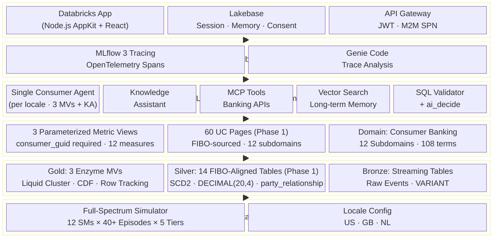
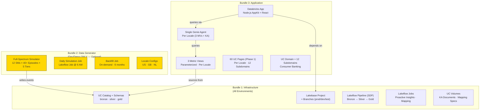
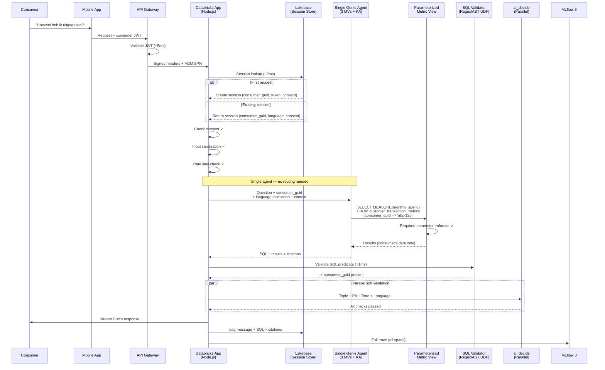
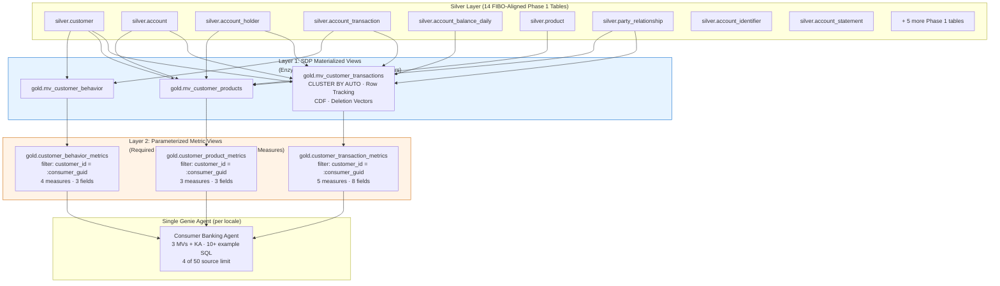
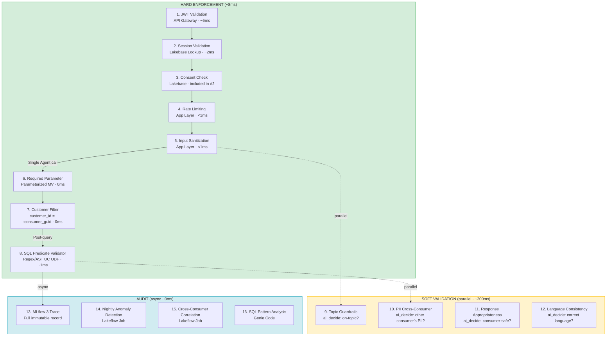
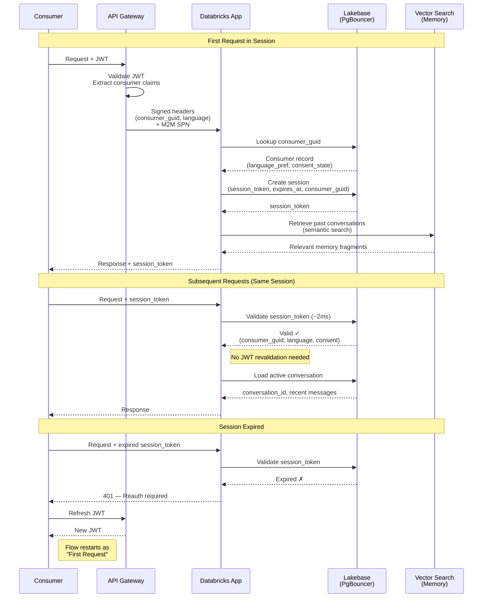
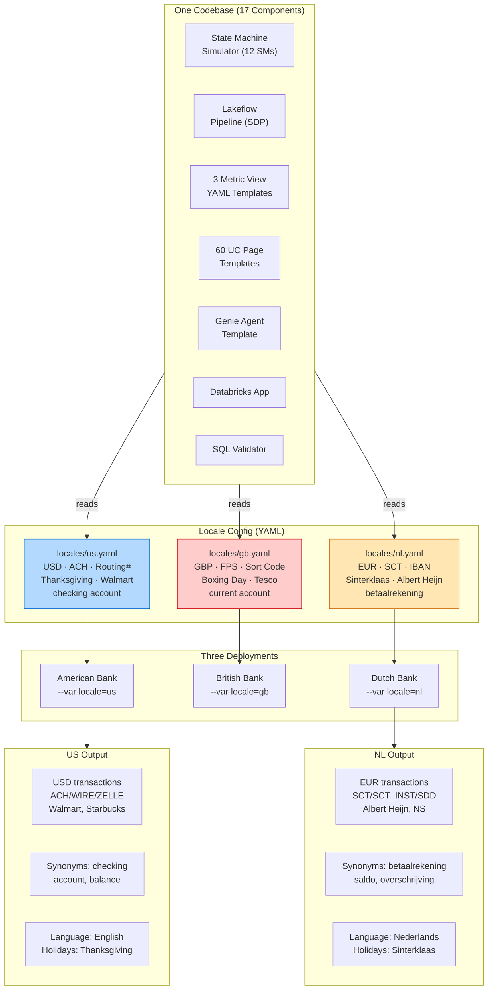
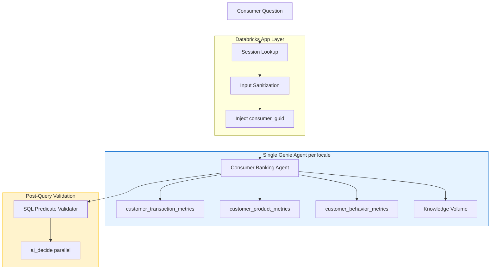

# L100 — Conversational Consumer Finance: System Overview

> Following your workflow, this is the markdown canvas companion to `docs/design/L100_system_overview.html`.
>
> Note: this markdown was reconstructed from the Session 4 design artifacts already in the repo (`docs/diagrams/`, pitch deck, and L100 HTML companion), because the original Genie One v5 canvas was not directly readable from this workspace.

## Overview

Conversational Consumer Finance is a governed AI agent that answers consumers' banking questions — accurately, securely, and in their language.

This document defines the system overview and constitution:

* 6 architecture layers
* 3 deployment bundles
* 12 measures / 14 dimensions
* 3 locales: US, GB, NL
* 12-week path to production

## Constitution

These principles govern every component, query, and deployment decision in the system.

### 1. Security is enforced, not implied

Every metric view requires a `consumer_guid` parameter with no default. A query without it fails — it does not return empty and does not fall back. Consumer isolation is enforced at the SQL layer, below the agent and the application.

### 2. Determinism over probability

Every metric has an exact SQL definition generated and tested from FIBO-informed semantics. There is no probabilistic graph traversal between a customer's question and their number.

### 3. One agent, not a swarm

A single Genie agent per locale serves every question from three metric views plus a Knowledge Assistant. No routing layer, no agent-to-agent handoffs, and no cross-agent governance gaps.

### 4. One codebase, any market

Locales are YAML configurations, not forks. The same components deploy as an American, British, or Dutch bank with a single variable.

### 5. The ontology is input

FIBO definitions feed Genie Code, which generates deterministic, tested UC Semantics. The ontology's value is captured; its complexity is not inherited.

### 6. Every answer is auditable

Each question produces an immutable MLflow 3 trace with 8 spans, streamed OpenTelemetry metrics, and automated alert rules. Any answer can be replayed for a regulator.

### 7. Fast at conversation speed

Enzyme-optimized materialized views keep query latency under 200ms and end-to-end response under 3s p99.

## Six-Layer Architecture

Each layer has a single responsibility and a single consumer above it. Governance happens once, at the platform, and every layer inherits it.

* **L6 — Consumer Application**: Databricks App, Lakebase, API Gateway
* **L5 — Observability**: MLflow 3, OpenTelemetry, Genie Code trace analysis
* **L4 — Agent Orchestration**: Single consumer agent per locale, Knowledge Assistant, MCP tools, Vector Search memory, SQL validator
* **L3 — Semantic Layer**: 3 parameterized metric views, 60 UC Pages, consumer banking domain semantics
* **L2 — Data Platform**: Bronze, Silver, Gold medallion architecture with Enzyme optimization
* **L1 — Data Generation**: Full-spectrum simulator and locale configuration, or real banking source systems

## Three-Bundle Deployment

Bundle 1 is the infrastructure and ships to every environment. Bundle 2 is the full-spectrum generator for dev/demo and is optional in production. Bundle 3 is the consumer application and semantic surface.

## Consumer Request Flow

A consumer question enters through the API Gateway, passes session and consent checks in Lakebase, then reaches a single agent. The agent queries a parameterized metric view with the required `consumer_guid`; a post-query SQL validator confirms the consumer predicate, while `ai_decide` checks topic, PII, appropriateness, and language in parallel. The full trace lands in MLflow 3.

## Semantic Layer

The semantic layer is a two-layer pattern:

* **Layer 1**: Enzyme-optimized materialized views for performance only
* **Layer 2**: consumer-facing parameterized metric views with `consumer_guid` required, 12 measures, 14 dimensions, and locale synonyms

The single Genie agent uses 4 of its 50 allowed sources: the three metric views plus the Knowledge Assistant volume.

## Security Model

There are 16 controls across 3 rings:

* **Hard enforcement (~8ms)**: JWT validation, session validation, consent, rate limiting, sanitization, required parameter, customer filter, SQL predicate validator
* **Soft validation (~200ms, parallel)**: topic, cross-consumer PII, response appropriateness, language consistency
* **Audit (async, 0ms)**: MLflow 3 trace, nightly anomaly detection, cross-consumer correlation, SQL pattern analysis

The parameterized metric view is the keystone: `consumer_guid` is required, with no default. A query without it fails.

## Data Platform

Bronze holds raw streaming events. Silver applies the FIBO-aligned model: 14 Phase 1 tables with SCD2, CDF, and precise money types. Gold implements the two-layer metric-view pattern. In production, the simulator is replaced by real source systems mapped through the same event contracts.

```mermaid
graph TB
    subgraph Generator["Bundle 2: Full-Spectrum Simulator (Dev/Demo)"]
        SM["12 Coupled State Machines\n× 40+ Episode Types\n× 5 Tiers × Locale Config"]
    end

    subgraph RealData["Production: Customer Source Systems"]
        Source["Core Banking\nCard Processing\nPayments"]
        GCMap["Genie Code\nMapping Workflow"]
    end

    subgraph Bronze["Bronze Layer (Streaming Tables)"]
        B_Acct["bronze.account_events"]
        B_Txn["bronze.transaction_events"]
        B_Prod["bronze.product_events"]
        B_Bal["bronze.balance_snapshots"]
        B_Party["bronze.party_events"]
    end

    subgraph Silver["Silver Layer (14 FIBO-Aligned Phase 1 Tables)"]
        S_Cust["silver.customer\nSCD2 · CDF"]
        S_Acct["silver.account\nSCD2 · CDF"]
        S_Hold["silver.account_holder\nSCD2 · CDF"]
        S_Txn["silver.account_transaction\nPartitioned · CDF"]
        S_Bal["silver.account_balance_daily\nPartitioned · CDF"]
        S_Prod["silver.product · CDF"]
        S_Party["silver.party_relationship\nJoin path: party → account"]
        S_Ident["silver.account_identifier"]
        S_Stmt["silver.account_statement"]
        S_More["+ 5 more Phase 1 tables"]
    end

    subgraph Gold["Gold Layer: Two-Layer Pattern"]
        subgraph L1["Layer 1: Enzyme Materialized Views"]
            MV1["mv_customer_transactions\nCLUSTER BY AUTO"]
            MV2["mv_customer_products"]
            MV3["mv_customer_behavior"]
        end
        subgraph L2["Layer 2: Parameterized Metric Views"]
            PM1["customer_transaction_metrics\nconsumer_guid REQUIRED"]
            PM2["customer_product_metrics\nconsumer_guid REQUIRED"]
            PM3["customer_behavior_metrics\nconsumer_guid REQUIRED"]
        end
    end

    subgraph Consumers["Single Genie Agent (per locale)"]
        GA["Consumer Banking Agent\n3 MVs + KA · 10+ example SQL"]
    end

    SM -->|"daily events"| Bronze
    Source -->|"real data"| GCMap
    GCMap -->|"mapped events"| Bronze

    Bronze -->|"SDP Pipeline\n(streaming)"| Silver
    Silver -->|"SDP Pipeline\n(incremental refresh)"| L1
    L1 --> L2
    L2 --> GA

    style Generator fill:#ffd700,stroke:#333
    style RealData fill:#e6ffe6,stroke:#333
    style L1 fill:#e6f3ff,stroke:#0066cc
    style L2 fill:#fff3e6,stroke:#cc6600
```

## Sessions & Memory

Lakebase owns session state. First request creates a session bound to the consumer GUID with language and consent state. Subsequent requests validate the session token in ~2ms without revalidating the JWT. Expired sessions require reauth. Vector Search provides long-term memory across sessions.

## Multi-Locale

All components are locale-neutral. Locale YAML files carry currency, payment rails, account naming, holidays, merchant mixes, and language. Deploying a new market is a config file and a bundle variable.

## Agent Orchestration

The app layer injects `consumer_guid` into every agent call. The Consumer Banking Agent answers from the three metric views and the Knowledge Assistant volume, then every generated SQL statement passes the predicate validator with `ai_decide` running in parallel. There is deliberately no router, no multi-agent graph, and no fallback path that bypasses the semantic layer.

## Delivery

### 12-week path to production

| Phase | Weeks | Focus |
| --- | --- | --- |
| Phase 1 | 1–2 | Foundation — data generation, FIBO mapping, Silver tables, first metric views |
| Phase 2 | 3–5 | App spike — consumer app, security pipeline, first working demo |
| Phase 3 | 6–9 | Expansion — full metric coverage, multi-locale, observability, benchmark suite |
| Phase 4 | 10–12 | Production — load testing, runbooks, alerting, go-live |

Staffing assumptions:

* ~0.75 Databricks FTE
* ~2.5 Bank FTE
* 2 weeks to first working demo

## Diagram Index

Interactive companions live in `docs/diagrams/html/`, with lightweight wrappers in `docs/diagrams/svg/` and sources in `docs/diagrams/mermaid/`.

* `01_six_layer_architecture.md`
* `02_three_bundle_deployment.md`
* `03_consumer_request_flow.md`
* `04_two_layer_metric_view.md`
* `05_layered_security_model.md`
* `06_account_lifecycle_state_machine.md`
* `07_transaction_processing_state_machine.md`
* `08_product_relationship_state_machine.md`
* `09_state_machine_coupling_points.md`
* `10_medallion_architecture.md`
* `11_lakebase_session_lifecycle.md`
* `12_genie_code_data_mapping_workflow.md`
* `13_locale_abstraction.md`
* `14_daily_simulation_execution_flow.md`
* `15_agent_orchestration_routing.md`
* `16_two_layer_metric_view_data_flow.md`
* `17_genie_code_mapping_workflow.md`
