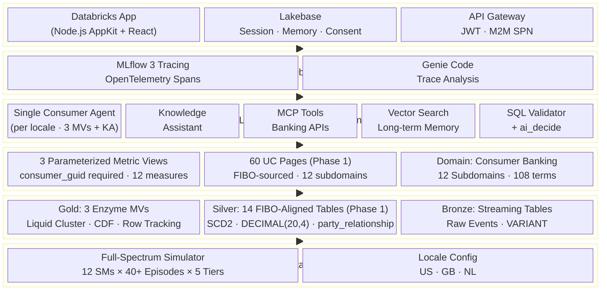

```mermaid
block-beta
    columns 1

    block:L6["Layer 6: Consumer Application"]:1
        App["Databricks App\n(Node.js AppKit + React)"]
        Lakebase["Lakebase\nSession · Memory · Consent"]
        Gateway["API Gateway\nJWT · M2M SPN"]
    end

    block:L5["Layer 5: Observability"]:1
        MLflow["MLflow 3 Tracing\nOpenTelemetry Spans"]
        GenieCode["Genie Code\nTrace Analysis"]
    end

    block:L4["Layer 4: Agent Orchestration"]:1
        SingleAgent["Single Consumer Agent\n(per locale · 3 MVs + KA)"]
        KA["Knowledge\nAssistant"]
        MCP["MCP Tools\nBanking APIs"]
        VectorSearch["Vector Search\nLong-term Memory"]
        Validator["SQL Validator\n+ ai_decide"]
    end

    block:L3["Layer 3: Semantic Layer (UC Semantics)"]:1
        MetricViews["3 Parameterized Metric Views\nconsumer_guid required · 12 measures"]
        Pages["60 UC Pages (Phase 1)\nFIBO-sourced · 12 subdomains"]
        Domains["Domain: Consumer Banking\n12 Subdomains · 108 terms"]
    end

    block:L2["Layer 2: Data Platform (Medallion)"]:1
        Gold["Gold: 3 Enzyme MVs\nLiquid Cluster · CDF · Row Tracking"]
        Silver["Silver: 14 FIBO-Aligned Tables (Phase 1)\nSCD2 · DECIMAL(20,4) · party_relationship"]
        Bronze["Bronze: Streaming Tables\nRaw Events · VARIANT"]
    end

    block:L1["Layer 1: Data Generation"]:1
        StateMachine["Full-Spectrum Simulator\n12 SMs × 40+ Episodes × 5 Tiers"]
        LocaleConfig["Locale Config\nUS · GB · NL"]
    end

    L6 --> L5
    L5 --> L4
    L4 --> L3
    L3 --> L2
    L2 --> L1
```