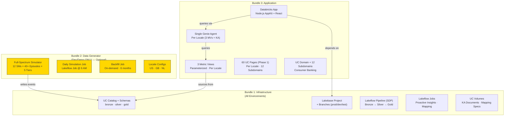

```mermaid
graph TB
    subgraph B1["Bundle 1: Infrastructure<br/>(All Environments)"]
        B1_UC["UC Catalog + Schemas<br/>bronze · silver · gold"]
        B1_LB["Lakebase Project<br/>+ Branches (prod/dev/test)"]
        B1_SDP["Lakeflow Pipeline (SDP)<br/>Bronze → Silver → Gold"]
        B1_Jobs["Lakeflow Jobs<br/>Proactive Insights · Mapping"]
        B1_Vol["UC Volumes<br/>KA Documents · Mapping Specs"]
    end

    subgraph B2["Bundle 2: Data Generator<br/>(Dev/Demo ONLY — Optional)"]
        B2_SM["Full-Spectrum Simulator<br/>12 SMs × 40+ Episodes × 5 Tiers"]
        B2_Daily["Daily Simulation Job<br/>Lakeflow Job @ 6 AM"]
        B2_Back["Backfill Job<br/>On-demand · 6 months"]
        B2_Locale["Locale Configs<br/>US · GB · NL"]
    end

    subgraph B3["Bundle 3: Application<br/>(All Environments)"]
        B3_App["Databricks App<br/>Node.js AppKit + React"]
        B3_GA["Single Genie Agent<br/>Per Locale (3 MVs + KA)"]
        B3_MV["3 Metric Views<br/>Parameterized · Per Locale"]
        B3_Pages["60 UC Pages (Phase 1)<br/>Per Locale · 12 Subdomains"]
        B3_Domain["UC Domain + 12 Subdomains<br/>Consumer Banking"]
    end

    B2_SM -->|"writes events"| B1_UC
    B3_App -->|"depends on"| B1_LB
    B3_App -->|"queries via"| B3_GA
    B3_GA -->|"queries"| B3_MV
    B3_MV -->|"sources from"| B1_UC

    style B2_SM fill:#ffd700,stroke:#333
    style B2_Daily fill:#ffd700,stroke:#333
    style B2_Back fill:#ffd700,stroke:#333
    style B2_Locale fill:#ffd700,stroke:#333
```