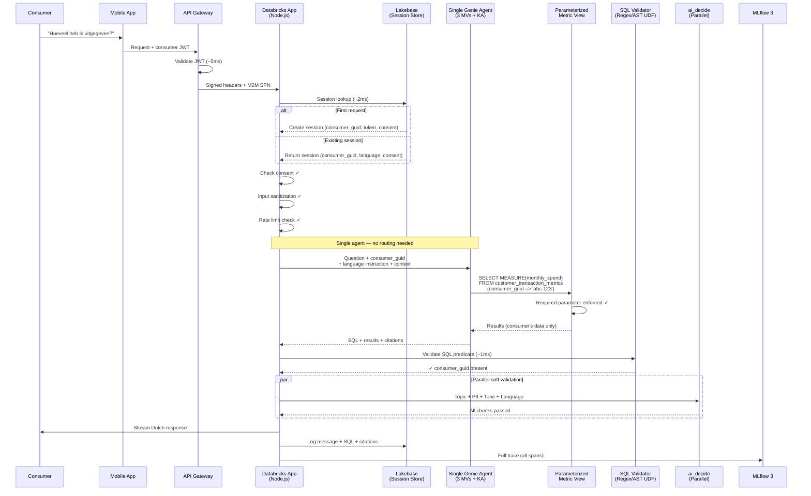

```mermaid
sequenceDiagram
    participant Consumer
    participant MobileApp as Mobile App
    participant Gateway as API Gateway
    participant App as Databricks App<br/>(Node.js)
    participant LB as Lakebase<br/>(Session Store)
    participant Agent as Single Genie Agent<br/>(3 MVs + KA)
    participant MV as Parameterized<br/>Metric View
    participant Validator as SQL Validator<br/>(Regex/AST UDF)
    participant AiDecide as ai_decide<br/>(Parallel)
    participant MLflow as MLflow 3

    Consumer->>MobileApp: "Hoeveel heb ik uitgegeven?"
    MobileApp->>Gateway: Request + consumer JWT
    Gateway->>Gateway: Validate JWT (~5ms)
    Gateway->>App: Signed headers + M2M SPN

    App->>LB: Session lookup (~2ms)
    alt First request
        LB-->>App: Create session (consumer_guid, token, consent)
    else Existing session
        LB-->>App: Return session (consumer_guid, language, consent)
    end

    App->>App: Check consent ✓
    App->>App: Input sanitization ✓
    App->>App: Rate limit check ✓

    Note over App,Agent: Single agent — no routing needed
    App->>Agent: Question + consumer_guid<br/>+ language instruction + context
    Agent->>MV: SELECT MEASURE(monthly_spend)<br/>FROM customer_transaction_metrics<br/>(consumer_guid => 'abc-123')
    MV->>MV: Required parameter enforced ✓
    MV-->>Agent: Results (consumer's data only)
    Agent-->>App: SQL + results + citations

    App->>Validator: Validate SQL predicate (~1ms)
    Validator-->>App: ✓ consumer_guid present

    par Parallel soft validation
        App->>AiDecide: Topic + PII + Tone + Language
        AiDecide-->>App: All checks passed
    end

    App->>Consumer: Stream Dutch response
    App->>LB: Log message + SQL + citations
    App->>MLflow: Full trace (all spans)
```