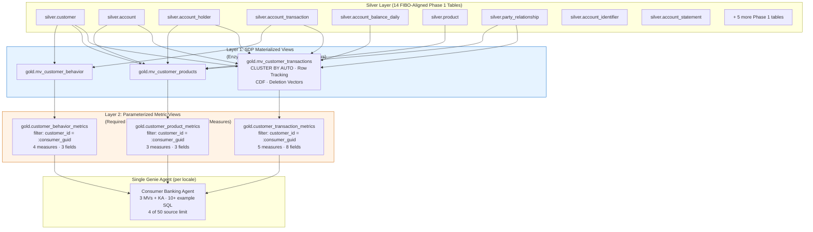

```mermaid
graph TB
    subgraph Silver["Silver Layer (14 FIBO-Aligned Phase 1 Tables)"]
        S_Cust["silver.customer"]
        S_Acct["silver.account"]
        S_Hold["silver.account_holder"]
        S_Txn["silver.account_transaction"]
        S_Bal["silver.account_balance_daily"]
        S_Prod["silver.product"]
        S_Party["silver.party_relationship"]
        S_Ident["silver.account_identifier"]
        S_Stmt["silver.account_statement"]
        S_More["+ 5 more Phase 1 tables"]
    end

    subgraph Layer1["Layer 1: SDP Materialized Views<br/>(Enzyme-Optimized · NO RLS · NO Parameters)"]
        MV_Txn["gold.mv_customer_transactions<br/>CLUSTER BY AUTO · Row Tracking<br/>CDF · Deletion Vectors"]
        MV_Prod["gold.mv_customer_products"]
        MV_Behav["gold.mv_customer_behavior"]
    end

    subgraph Layer2["Layer 2: Parameterized Metric Views<br/>(Required consumer_guid · Locale Synonyms · 12 Measures)"]
        PM_Txn["gold.customer_transaction_metrics<br/>filter: customer_id = :consumer_guid<br/>5 measures · 8 fields"]
        PM_Prod["gold.customer_product_metrics<br/>filter: customer_id = :consumer_guid<br/>3 measures · 3 fields"]
        PM_Behav["gold.customer_behavior_metrics<br/>filter: customer_id = :consumer_guid<br/>4 measures · 3 fields"]
    end

    subgraph Consumers["Single Genie Agent (per locale)"]
        GA["Consumer Banking Agent<br/>3 MVs + KA · 10+ example SQL<br/>4 of 50 source limit"]
    end

    S_Cust --> MV_Txn
    S_Acct --> MV_Txn
    S_Hold --> MV_Txn
    S_Txn --> MV_Txn
    S_Bal --> MV_Txn
    S_Party --> MV_Txn
    S_Acct --> MV_Prod
    S_Hold --> MV_Prod
    S_Cust --> MV_Prod
    S_Prod --> MV_Prod
    S_Party --> MV_Prod
    S_Txn --> MV_Behav
    S_Cust --> MV_Behav

    MV_Txn --> PM_Txn
    MV_Prod --> PM_Prod
    MV_Behav --> PM_Behav

    PM_Txn --> GA
    PM_Prod --> GA
    PM_Behav --> GA

    style Layer1 fill:#e6f3ff,stroke:#0066cc
    style Layer2 fill:#fff3e6,stroke:#cc6600
```