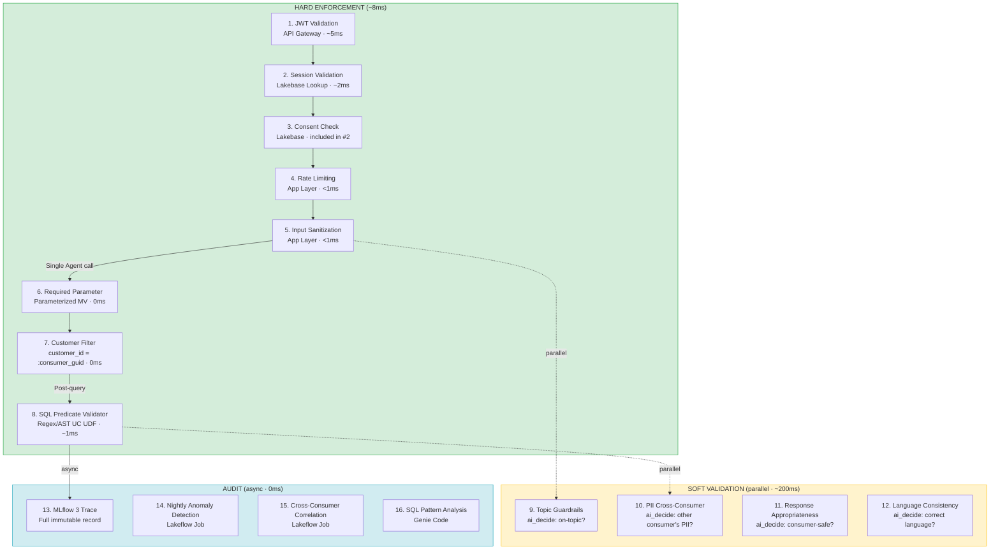

```mermaid
graph TB
    subgraph Hard["HARD ENFORCEMENT (~8ms)"]
        direction TB
        H1["1. JWT Validation<br/>API Gateway · ~5ms"]
        H2["2. Session Validation<br/>Lakebase Lookup · ~2ms"]
        H3["3. Consent Check<br/>Lakebase · included in #2"]
        H4["4. Rate Limiting<br/>App Layer · <1ms"]
        H5["5. Input Sanitization<br/>App Layer · <1ms"]
        H6["6. Required Parameter<br/>Parameterized MV · 0ms"]
        H7["7. Customer Filter<br/>customer_id = :consumer_guid · 0ms"]
        H8["8. SQL Predicate Validator<br/>Regex/AST UC UDF · ~1ms"]
    end

    subgraph Soft["SOFT VALIDATION (parallel · ~200ms)"]
        direction TB
        S1["9. Topic Guardrails<br/>ai_decide: on-topic?"]
        S2["10. PII Cross-Consumer<br/>ai_decide: other consumer's PII?"]
        S3["11. Response Appropriateness<br/>ai_decide: consumer-safe?"]
        S4["12. Language Consistency<br/>ai_decide: correct language?"]
    end

    subgraph Audit["AUDIT (async · 0ms)"]
        direction TB
        A1["13. MLflow 3 Trace<br/>Full immutable record"]
        A2["14. Nightly Anomaly Detection<br/>Lakeflow Job"]
        A3["15. Cross-Consumer Correlation<br/>Lakeflow Job"]
        A4["16. SQL Pattern Analysis<br/>Genie Code"]
    end

    H1 --> H2 --> H3 --> H4 --> H5
    H5 -->|"Single Agent call"| H6 --> H7
    H7 -->|"Post-query"| H8

    H5 -.->|"parallel"| S1
    H8 -.->|"parallel"| S2

    H8 -->|"async"| A1

    style Hard fill:#d4edda,stroke:#28a745
    style Soft fill:#fff3cd,stroke:#ffc107
    style Audit fill:#d1ecf1,stroke:#17a2b8
```