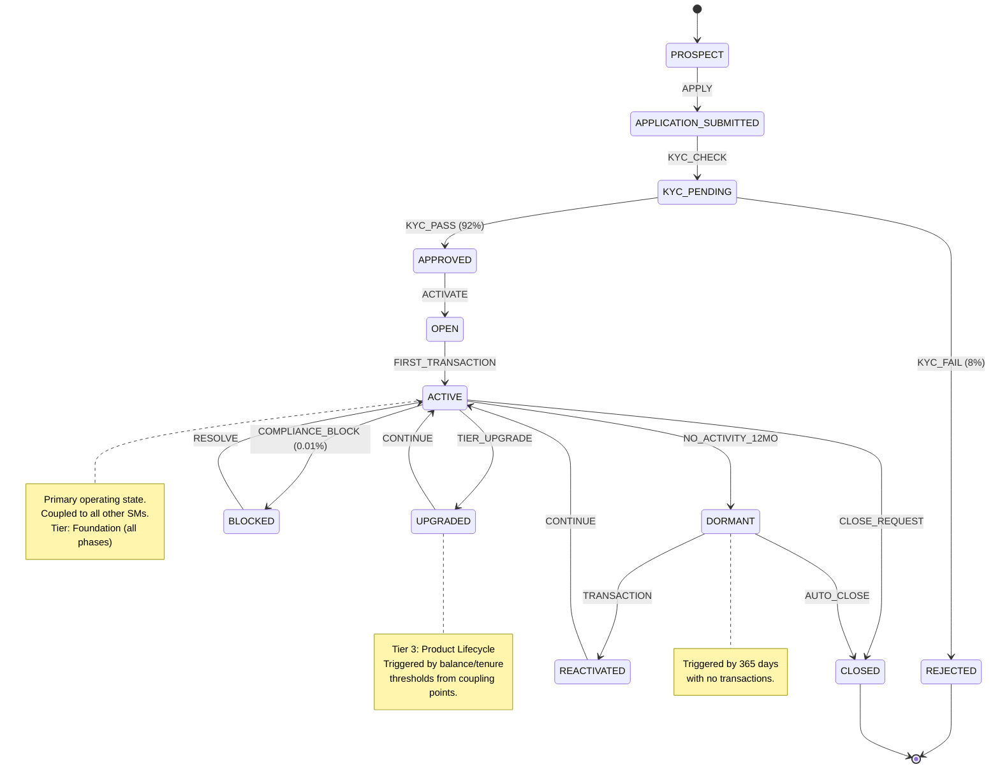

```mermaid
stateDiagram-v2
    [*] --> PROSPECT

    PROSPECT --> APPLICATION_SUBMITTED: APPLY
    APPLICATION_SUBMITTED --> KYC_PENDING: KYC_CHECK

    KYC_PENDING --> APPROVED: KYC_PASS (92%)
    KYC_PENDING --> REJECTED: KYC_FAIL (8%)
    REJECTED --> [*]

    APPROVED --> OPEN: ACTIVATE
    OPEN --> ACTIVE: FIRST_TRANSACTION

    ACTIVE --> DORMANT: NO_ACTIVITY_12MO
    ACTIVE --> BLOCKED: COMPLIANCE_BLOCK (0.01%)
    ACTIVE --> CLOSED: CLOSE_REQUEST
    ACTIVE --> UPGRADED: TIER_UPGRADE

    DORMANT --> REACTIVATED: TRANSACTION
    DORMANT --> CLOSED: AUTO_CLOSE

    REACTIVATED --> ACTIVE: CONTINUE

    BLOCKED --> ACTIVE: RESOLVE

    UPGRADED --> ACTIVE: CONTINUE

    CLOSED --> [*]

    note right of ACTIVE
        Primary operating state.
        Coupled to all other SMs.
        Tier: Foundation (all phases)
    end note

    note right of UPGRADED
        Tier 3: Product Lifecycle
        Triggered by balance/tenure
        thresholds from coupling points.
    end note

    note right of DORMANT
        Triggered by 365 days
        with no transactions.
    end note
```