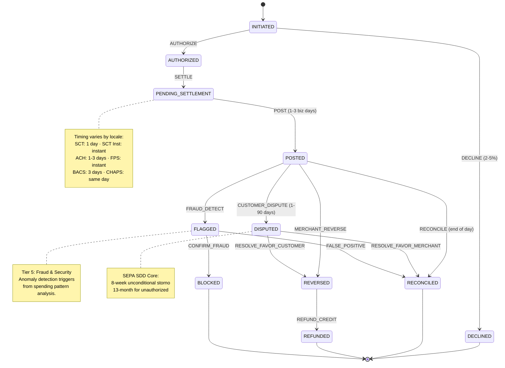

```mermaid
stateDiagram-v2
    [*] --> INITIATED

    INITIATED --> AUTHORIZED: AUTHORIZE
    INITIATED --> DECLINED: DECLINE (2-5%)

    AUTHORIZED --> PENDING_SETTLEMENT: SETTLE
    PENDING_SETTLEMENT --> POSTED: POST (1-3 biz days)

    POSTED --> RECONCILED: RECONCILE (end of day)
    POSTED --> DISPUTED: CUSTOMER_DISPUTE (1-90 days)
    POSTED --> REVERSED: MERCHANT_REVERSE
    POSTED --> FLAGGED: FRAUD_DETECT

    DISPUTED --> REVERSED: RESOLVE_FAVOR_CUSTOMER
    DISPUTED --> RECONCILED: RESOLVE_FAVOR_MERCHANT

    REVERSED --> REFUNDED: REFUND_CREDIT

    FLAGGED --> BLOCKED: CONFIRM_FRAUD
    FLAGGED --> RECONCILED: FALSE_POSITIVE

    DECLINED --> [*]
    RECONCILED --> [*]
    REFUNDED --> [*]
    BLOCKED --> [*]

    note right of PENDING_SETTLEMENT
        Timing varies by locale:
        SCT: 1 day · SCT Inst: instant
        ACH: 1-3 days · FPS: instant
        BACS: 3 days · CHAPS: same day
    end note

    note right of FLAGGED
        Tier 5: Fraud & Security
        Anomaly detection triggers
        from spending pattern analysis.
    end note

    note right of DISPUTED
        SEPA SDD Core:
        8-week unconditional storno
        13-month for unauthorized
    end note
```