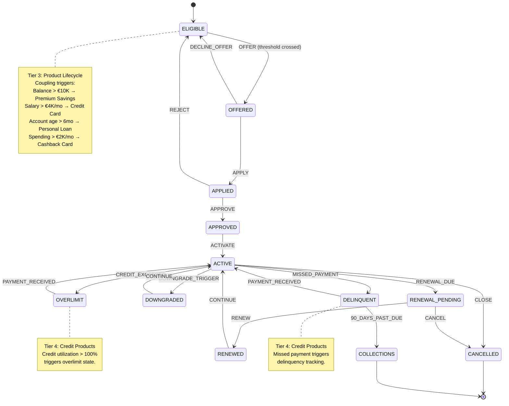

```mermaid
stateDiagram-v2
    [*] --> ELIGIBLE

    ELIGIBLE --> OFFERED: OFFER (threshold crossed)
    OFFERED --> APPLIED: APPLY
    OFFERED --> ELIGIBLE: DECLINE_OFFER

    APPLIED --> APPROVED: APPROVE
    APPLIED --> ELIGIBLE: REJECT

    APPROVED --> ACTIVE: ACTIVATE

    ACTIVE --> RENEWAL_PENDING: RENEWAL_DUE
    ACTIVE --> DOWNGRADED: DOWNGRADE_TRIGGER
    ACTIVE --> OVERLIMIT: CREDIT_EXCEEDED
    ACTIVE --> DELINQUENT: MISSED_PAYMENT
    ACTIVE --> CANCELLED: CLOSE

    RENEWAL_PENDING --> RENEWED: RENEW
    RENEWAL_PENDING --> CANCELLED: CANCEL

    RENEWED --> ACTIVE: CONTINUE
    DOWNGRADED --> ACTIVE: CONTINUE
    OVERLIMIT --> ACTIVE: PAYMENT_RECEIVED
    DELINQUENT --> ACTIVE: PAYMENT_RECEIVED
    DELINQUENT --> COLLECTIONS: 90_DAYS_PAST_DUE

    CANCELLED --> [*]
    COLLECTIONS --> [*]

    note right of ELIGIBLE
        Tier 3: Product Lifecycle
        Coupling triggers:
        Balance > €10K → Premium Savings
        Salary > €4K/mo → Credit Card
        Account age > 6mo → Personal Loan
        Spending > €2K/mo → Cashback Card
    end note

    note right of OVERLIMIT
        Tier 4: Credit Products
        Credit utilization > 100%
        triggers overlimit state.
    end note

    note right of DELINQUENT
        Tier 4: Credit Products
        Missed payment triggers
        delinquency tracking.
    end note
```