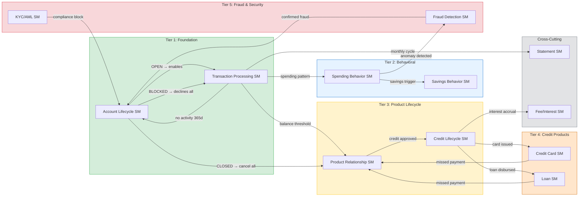

```mermaid
graph LR
    subgraph Tier1["Tier 1: Foundation"]
        A_SM["Account Lifecycle SM"]
        T_SM["Transaction Processing SM"]
    end

    subgraph Tier2["Tier 2: Behavioral"]
        B_SM["Spending Behavior SM"]
        S_SM["Savings Behavior SM"]
    end

    subgraph Tier3["Tier 3: Product Lifecycle"]
        P_SM["Product Relationship SM"]
        CL_SM["Credit Lifecycle SM"]
    end

    subgraph Tier4["Tier 4: Credit Products"]
        CC_SM["Credit Card SM"]
        LN_SM["Loan SM"]
    end

    subgraph Tier5["Tier 5: Fraud & Security"]
        FR_SM["Fraud Detection SM"]
        KY_SM["KYC/AML SM"]
    end

    subgraph Cross["Cross-Cutting"]
        ST_SM["Statement SM"]
        FE_SM["Fee/Interest SM"]
    end

    A_SM -->|"OPEN → enables"| T_SM
    A_SM -->|"BLOCKED → declines all"| T_SM
    T_SM -->|"no activity 365d"| A_SM
    T_SM -->|"balance threshold"| P_SM
    T_SM -->|"spending pattern"| B_SM
    B_SM -->|"anomaly detected"| FR_SM
    B_SM -->|"savings trigger"| S_SM
    P_SM -->|"credit approved"| CL_SM
    CL_SM -->|"card issued"| CC_SM
    CL_SM -->|"loan disbursed"| LN_SM
    CC_SM -->|"missed payment"| P_SM
    LN_SM -->|"missed payment"| P_SM
    FR_SM -->|"confirmed fraud"| A_SM
    KY_SM -->|"compliance block"| A_SM
    A_SM -->|"CLOSED → cancel all"| P_SM
    T_SM -->|"monthly cycle"| ST_SM
    CL_SM -->|"interest accrual"| FE_SM

    style Tier1 fill:#d4edda,stroke:#28a745
    style Tier2 fill:#e6f3ff,stroke:#0066cc
    style Tier3 fill:#fff3cd,stroke:#ffc107
    style Tier4 fill:#ffe6cc,stroke:#cc6600
    style Tier5 fill:#f8d7da,stroke:#dc3545
    style Cross fill:#e2e3e5,stroke:#6c757d
```