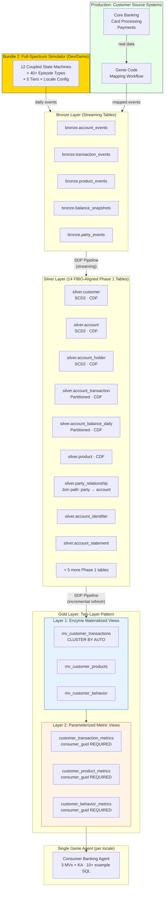

```mermaid
graph TB
    subgraph Generator["Bundle 2: Full-Spectrum Simulator (Dev/Demo)"]
        SM["12 Coupled State Machines\n× 40+ Episode Types\n× 5 Tiers × Locale Config"]
    end

    subgraph RealData["Production: Customer Source Systems"]
        Source["Core Banking\nCard Processing\nPayments"]
        GCMap["Genie Code\nMapping Workflow"]
    end

    subgraph Bronze["Bronze Layer (Streaming Tables)"]
        B_Acct["bronze.account_events"]
        B_Txn["bronze.transaction_events"]
        B_Prod["bronze.product_events"]
        B_Bal["bronze.balance_snapshots"]
        B_Party["bronze.party_events"]
    end

    subgraph Silver["Silver Layer (14 FIBO-Aligned Phase 1 Tables)"]
        S_Cust["silver.customer\nSCD2 · CDF"]
        S_Acct["silver.account\nSCD2 · CDF"]
        S_Hold["silver.account_holder\nSCD2 · CDF"]
        S_Txn["silver.account_transaction\nPartitioned · CDF"]
        S_Bal["silver.account_balance_daily\nPartitioned · CDF"]
        S_Prod["silver.product · CDF"]
        S_Party["silver.party_relationship\nJoin path: party → account"]
        S_Ident["silver.account_identifier"]
        S_Stmt["silver.account_statement"]
        S_More["+ 5 more Phase 1 tables"]
    end

    subgraph Gold["Gold Layer: Two-Layer Pattern"]
        subgraph L1["Layer 1: Enzyme Materialized Views"]
            MV1["mv_customer_transactions\nCLUSTER BY AUTO"]
            MV2["mv_customer_products"]
            MV3["mv_customer_behavior"]
        end
        subgraph L2["Layer 2: Parameterized Metric Views"]
            PM1["customer_transaction_metrics\nconsumer_guid REQUIRED"]
            PM2["customer_product_metrics\nconsumer_guid REQUIRED"]
            PM3["customer_behavior_metrics\nconsumer_guid REQUIRED"]
        end
    end

    subgraph Consumers["Single Genie Agent (per locale)"]
        GA["Consumer Banking Agent\n3 MVs + KA · 10+ example SQL"]
    end

    SM -->|"daily events"| Bronze
    Source -->|"real data"| GCMap
    GCMap -->|"mapped events"| Bronze

    Bronze -->|"SDP Pipeline\n(streaming)"| Silver
    Silver -->|"SDP Pipeline\n(incremental refresh)"| L1
    L1 --> L2
    L2 --> GA

    style Generator fill:#ffd700,stroke:#333
    style RealData fill:#e6ffe6,stroke:#333
    style L1 fill:#e6f3ff,stroke:#0066cc
    style L2 fill:#fff3e6,stroke:#cc6600
```