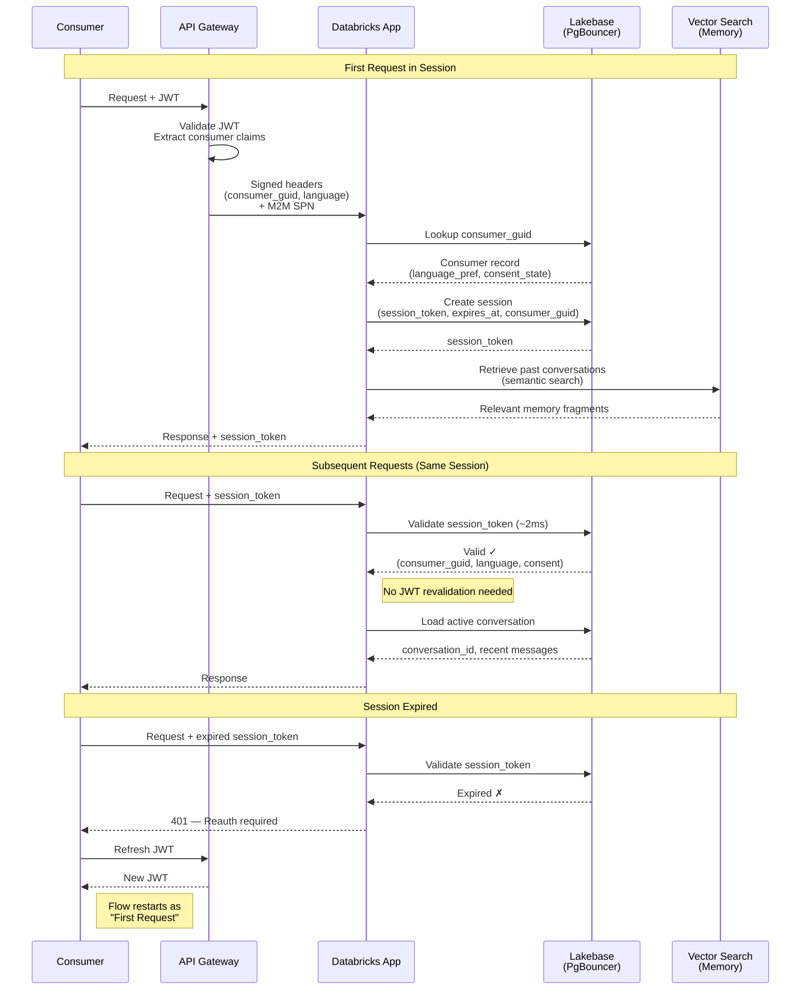

```mermaid
sequenceDiagram
    participant Consumer
    participant Gateway as API Gateway
    participant App as Databricks App
    participant LB as Lakebase<br/>(PgBouncer)
    participant VS as Vector Search<br/>(Memory)

    Note over Consumer,VS: First Request in Session

    Consumer->>Gateway: Request + JWT
    Gateway->>Gateway: Validate JWT<br/>Extract consumer claims
    Gateway->>App: Signed headers<br/>(consumer_guid, language)<br/>+ M2M SPN

    App->>LB: Lookup consumer_guid
    LB-->>App: Consumer record<br/>(language_pref, consent_state)
    App->>LB: Create session<br/>(session_token, expires_at, consumer_guid)
    LB-->>App: session_token
    App->>VS: Retrieve past conversations<br/>(semantic search)
    VS-->>App: Relevant memory fragments
    App-->>Consumer: Response + session_token

    Note over Consumer,VS: Subsequent Requests (Same Session)

    Consumer->>App: Request + session_token
    App->>LB: Validate session_token (~2ms)
    LB-->>App: Valid ✓<br/>(consumer_guid, language, consent)
    Note right of App: No JWT revalidation needed
    App->>LB: Load active conversation
    LB-->>App: conversation_id, recent messages
    App-->>Consumer: Response

    Note over Consumer,VS: Session Expired

    Consumer->>App: Request + expired session_token
    App->>LB: Validate session_token
    LB-->>App: Expired ✗
    App-->>Consumer: 401 — Reauth required
    Consumer->>Gateway: Refresh JWT
    Gateway-->>Consumer: New JWT
    Note right of Consumer: Flow restarts as<br/>"First Request"
```