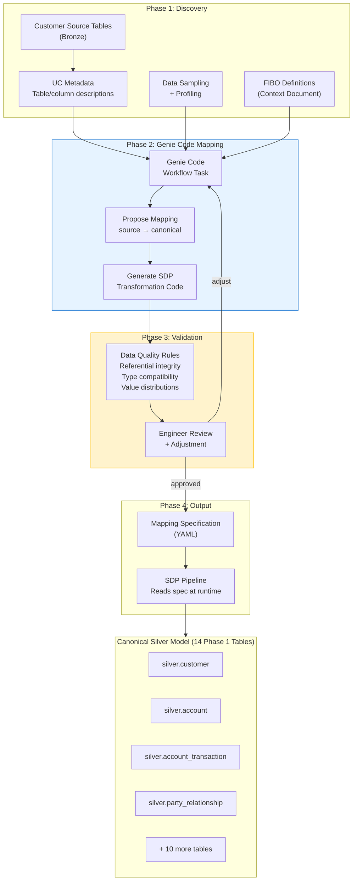

```mermaid
graph TB
    subgraph Phase1["Phase 1: Discovery"]
        Src["Customer Source Tables<br/>(Bronze)"]
        UC_Meta["UC Metadata<br/>Table/column descriptions"]
        Sample["Data Sampling<br/>+ Profiling"]
        FIBO["FIBO Definitions<br/>(Context Document)"]
    end

    subgraph Phase2["Phase 2: Genie Code Mapping"]
        GC["Genie Code<br/>Workflow Task"]
        Propose["Propose Mapping<br/>source → canonical"]
        Generate["Generate SDP<br/>Transformation Code"]
    end

    subgraph Phase3["Phase 3: Validation"]
        DQ["Data Quality Rules<br/>Referential integrity<br/>Type compatibility<br/>Value distributions"]
        Review["Engineer Review<br/>+ Adjustment"]
    end

    subgraph Phase4["Phase 4: Output"]
        Spec["Mapping Specification<br/>(YAML)"]
        Pipeline["SDP Pipeline<br/>Reads spec at runtime"]
    end

    subgraph Canonical["Canonical Silver Model (14 Phase 1 Tables)"]
        S_Cust["silver.customer"]
        S_Acct["silver.account"]
        S_Txn["silver.account_transaction"]
        S_Party["silver.party_relationship"]
        S_More["+ 10 more tables"]
    end

    Src --> UC_Meta --> GC
    Sample --> GC
    FIBO --> GC

    GC --> Propose --> Generate
    Generate --> DQ
    DQ --> Review
    Review -->|"approved"| Spec
    Review -->|"adjust"| GC

    Spec --> Pipeline
    Pipeline --> Canonical

    style Phase2 fill:#e6f3ff,stroke:#0066cc
    style Phase3 fill:#fff3cd,stroke:#ffc107
```