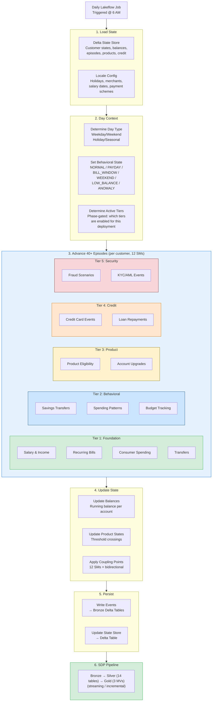

```mermaid
graph TB
    Start["Daily Lakeflow Job<br/>Triggered @ 6 AM"]

    subgraph Load["1. Load State"]
        State["Delta State Store<br/>Customer states, balances,<br/>episodes, products, credit"]
        Locale["Locale Config<br/>Holidays, merchants,<br/>salary dates, payment schemes"]
    end

    subgraph Context["2. Day Context"]
        DayType["Determine Day Type<br/>Weekday/Weekend<br/>Holiday/Seasonal"]
        Behavior["Set Behavioral State<br/>NORMAL / PAYDAY /<br/>BILL_WINDOW / WEEKEND /<br/>LOW_BALANCE / ANOMALY"]
        Tier["Determine Active Tiers<br/>Phase-gated: which tiers<br/>are enabled for this deployment"]
    end

    subgraph Episodes["3. Advance 40+ Episodes (per customer, 12 SMs)"]
        subgraph T1["Tier 1: Foundation"]
            E1["Salary & Income"]
            E2["Recurring Bills"]
            E3["Consumer Spending"]
            E4["Transfers"]
        end
        subgraph T2["Tier 2: Behavioral"]
            E5["Savings Transfers"]
            E6["Spending Patterns"]
            E7["Budget Tracking"]
        end
        subgraph T3["Tier 3: Product"]
            E8["Product Eligibility"]
            E9["Account Upgrades"]
        end
        subgraph T4["Tier 4: Credit"]
            E10["Credit Card Events"]
            E11["Loan Repayments"]
        end
        subgraph T5["Tier 5: Security"]
            E12["Fraud Scenarios"]
            E13["KYC/AML Events"]
        end
    end

    subgraph Update["4. Update State"]
        Balances["Update Balances<br/>Running balance per account"]
        Products["Update Product States<br/>Threshold crossings"]
        Coupling["Apply Coupling Points<br/>12 SMs × bidirectional"]
    end

    subgraph Persist["5. Persist"]
        Bronze["Write Events<br/>→ Bronze Delta Tables"]
        StateStore["Update State Store<br/>→ Delta Table"]
    end

    subgraph Pipeline["6. SDP Pipeline"]
        SDP["Bronze → Silver (14 tables) → Gold (3 MVs)<br/>(streaming / incremental)"]
    end

    Start --> Load
    Load --> Context
    Context --> Episodes
    Episodes --> Update
    Update --> Persist
    Persist --> Pipeline

    style Episodes fill:#e6f3ff,stroke:#0066cc
    style Pipeline fill:#d4edda,stroke:#28a745
    style T1 fill:#d4edda,stroke:#28a745
    style T2 fill:#cce5ff,stroke:#004085
    style T3 fill:#fff3cd,stroke:#856404
    style T4 fill:#ffe6cc,stroke:#cc6600
    style T5 fill:#f8d7da,stroke:#721c24
```