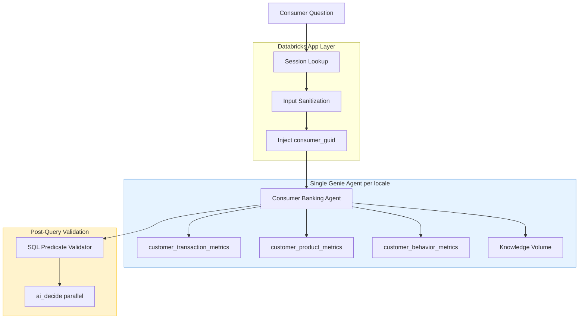

# 15 Agent Orchestration Routing

```mermaid
flowchart TB
    Consumer[Consumer Question]
    subgraph AppLayer[Databricks App Layer]
        Session[Session Lookup]
        Sanitize[Input Sanitization]
        Inject[Inject consumer_guid]
    end
    subgraph SingleAgent[Single Genie Agent per locale]
        Agent[Consumer Banking Agent]
        MV_Txn[customer_transaction_metrics]
        MV_Prod[customer_product_metrics]
        MV_Behav[customer_behavior_metrics]
        KA_Vol[Knowledge Volume]
    end
    subgraph PostQuery[Post-Query Validation]
        SQLVal[SQL Predicate Validator]
        AiDecide[ai_decide parallel]
    end
    Consumer --> Session --> Sanitize --> Inject
    Inject --> Agent
    Agent --> MV_Txn
    Agent --> MV_Prod
    Agent --> MV_Behav
    Agent --> KA_Vol
    Agent --> SQLVal --> AiDecide
    style SingleAgent fill:#e6f3ff,stroke:#0066cc
    style PostQuery fill:#fff3cd,stroke:#ffc107
```
