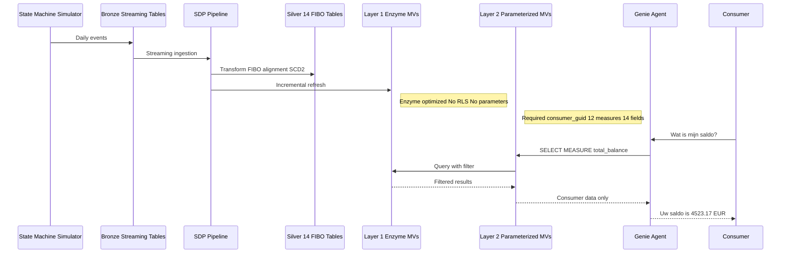

# 16 Two-Layer Metric View Data Flow

```mermaid
sequenceDiagram
    participant SM as State Machine Simulator
    participant Bronze as Bronze Streaming Tables
    participant SDP as SDP Pipeline
    participant Silver as Silver 14 FIBO Tables
    participant GoldMV as Layer 1 Enzyme MVs
    participant ParamMV as Layer 2 Parameterized MVs
    participant Agent as Genie Agent
    participant Cons as Consumer

    SM->>Bronze: Daily events
    Bronze->>SDP: Streaming ingestion
    SDP->>Silver: Transform FIBO alignment SCD2
    SDP->>GoldMV: Incremental refresh
    Note right of GoldMV: Enzyme optimized No RLS No parameters
    Note right of ParamMV: Required consumer_guid 12 measures 14 fields
    Cons->>Agent: Wat is mijn saldo?
    Agent->>ParamMV: SELECT MEASURE total_balance
    ParamMV->>GoldMV: Query with filter
    GoldMV-->>ParamMV: Filtered results
    ParamMV-->>Agent: Consumer data only
    Agent-->>Cons: Uw saldo is 4523.17 EUR
```
