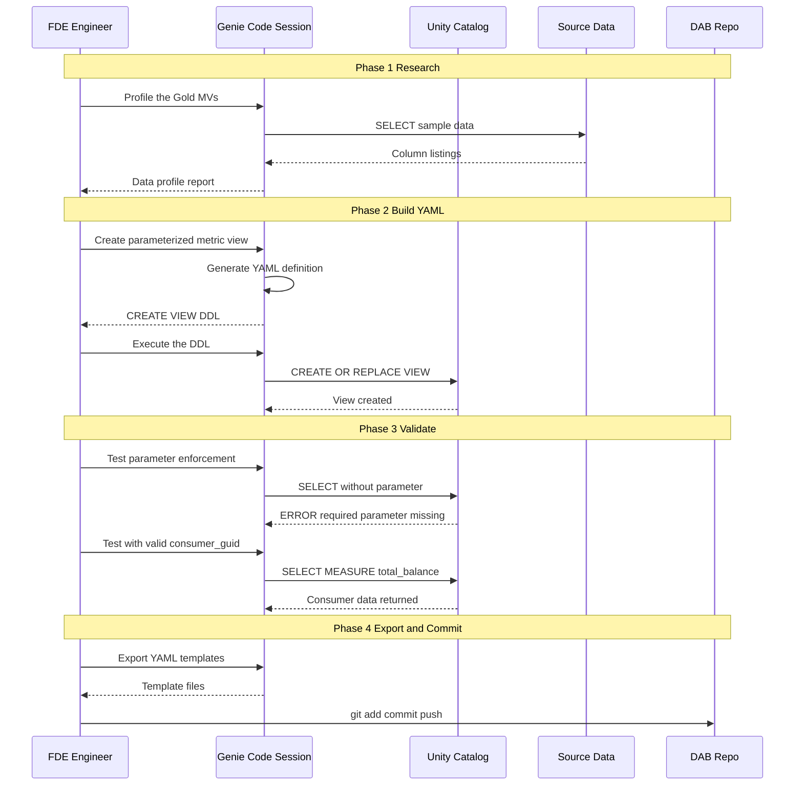

# 17 Genie Code Mapping Workflow

```mermaid
sequenceDiagram
    participant FDE as FDE Engineer
    participant GC as Genie Code Session
    participant UC as Unity Catalog
    participant Data as Source Data
    participant DAB as DAB Repo

    Note over FDE,DAB: Phase 1 Research
    FDE->>GC: Profile the Gold MVs
    GC->>Data: SELECT sample data
    Data-->>GC: Column listings
    GC-->>FDE: Data profile report

    Note over FDE,DAB: Phase 2 Build YAML
    FDE->>GC: Create parameterized metric view
    GC->>GC: Generate YAML definition
    GC-->>FDE: CREATE VIEW DDL
    FDE->>GC: Execute the DDL
    GC->>UC: CREATE OR REPLACE VIEW
    UC-->>GC: View created

    Note over FDE,DAB: Phase 3 Validate
    FDE->>GC: Test parameter enforcement
    GC->>UC: SELECT without parameter
    UC-->>GC: ERROR required parameter missing
    FDE->>GC: Test with valid consumer_guid
    GC->>UC: SELECT MEASURE total_balance
    UC-->>GC: Consumer data returned

    Note over FDE,DAB: Phase 4 Export and Commit
    FDE->>GC: Export YAML templates
    GC-->>FDE: Template files
    FDE->>DAB: git add commit push
```
